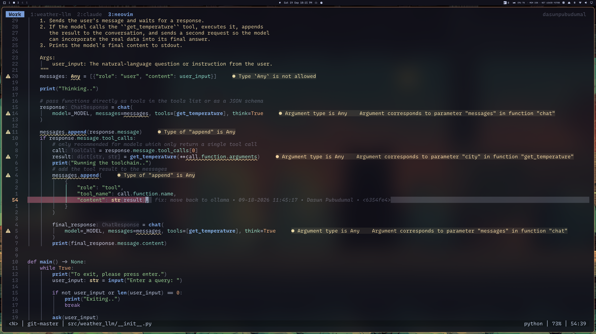
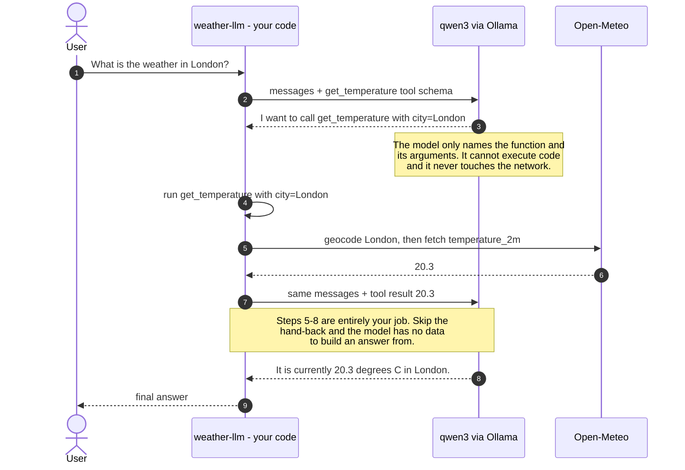

# NeoVim & LazyVim: A Practical Introduction

This notebook walks through five things every newcomer should understand before adopting NeoVim as a daily editor:

1. What is [NeoVim](https://neovim.io/doc/)
2. What is [LazyVim](https://www.lazyvim.org/)
3. Why you should use LazyVim
4. How to install LazyVim
5. How LazyVim configures packages and plugins

> This notebook is documentation-only — the code cells below show shell/Lua snippets as reference text, they are not meant to be executed inside Jupyter.

I first heard of NeoVim from a [YouTube channel](https://www.youtube.com/watch?v=X6AR2RMB5tE&list=PLm323Lc7iSW_wuxqmKx_xxNtJC_hJbQ7R) (highly recommended). The reason I myself decided to try it out was how cool-looking it was. However, I abandoned it later and went back to my comforts (Visual Studio Code). But later on - because by then I had some experience following the videos - I realised, bit by bit, how effective NeoVim can be. I have documented my experience in [my website](https://dasunpubudumal.github.io/blog/my-thoughts-on-using-neovim-for-programming/).

### How is this session structured?

In this session, we will install NeoVim, and install LazyVim on top. We will use LazyVim to program a fun little AI Agent that understands a user prompt related to weather, and use "[tool calling](https://machinelearningmastery.com/mastering-llm-tool-calling-the-complete-framework-for-connecting-models-to-the-real-world/)" pattern to invoke a [Web API](https://open-meteo.com/) and get the weather data for the user.

## 1. What is NeoVim?

**NeoVim** (`nvim`) is a fork of the classic **Vim** text editor, started in 2014 with the goal of modernizing Vim's codebase and making it more extensible, without abandoning Vim's modal-editing philosophy.

Key characteristics:

- **Modal editing** — like Vim, it has distinct modes (Normal, Insert, Visual, Command) so that navigation and text manipulation happen through composable keyboard commands instead of a mouse.
- **Built-in LSP client** — NeoVim ships with a native Language Server Protocol client, so it can get autocompletion, diagnostics, go-to-definition, and refactoring support directly from language servers (same servers that power VSCode).
- **Lua as a first-class scripting language** — in addition to Vimscript, NeoVim embeds LuaJIT, so plugins and configuration can be written in Lua, which is faster and easier to reason about than Vimscript.
- **Asynchronous job control** — plugins can run external processes (linters, formatters, compilers) without freezing the editor.
- **Better extensibility API** — a cleaner plugin API (`nvim_*` functions) and support for remote plugins in other languages.
- **Terminal emulator** — a built-in terminal you can open inside a split (`:terminal`).

In short: NeoVim is Vim's spiritual successor — same keyboard-driven editing model, but with a modern core that plugin authors and LSP/Treesitter integrations can build on much more easily.

## 2. What is LazyVim?

Raw NeoVim ships with almost no configuration — no file explorer, no fuzzy finder, no autocompletion, no LSP wiring. Setting all of that up by hand (a "from-scratch config") can take days or weeks of tinkering.

**LazyVim** is a pre-built, opinionated **NeoVim "distribution"** (a curated starter configuration) created by Folke Lemaitre. It bundles together:

- A plugin manager (**lazy.nvim**, also written by Folke) that lazy-loads plugins for fast startup.
- Sensible default keymaps, options, and UI (statusline, file explorer, fuzzy finder, which-key popup, etc.).
- Pre-wired **LSP**, **Treesitter**, **autocompletion**, **formatting**, and **linting** integrations.
- A modular "extras" system to toggle language- or feature-specific setups on/off (e.g. Python, Rust, Docker, Tailwind, DAP debugging).

Think of it the way you'd think of a Linux distribution versus the raw Linux kernel: NeoVim is the kernel/engine, LazyVim is a distribution that packages it into something usable out of the box, while still letting you customize every layer.

## 3. Why you should use LazyVim

- **Fast time-to-productivity** — you get a fully working IDE-like experience (LSP, autocomplete, fuzzy find, git signs, debugging) in minutes instead of hand-rolling a config over weeks.
- **Sane, curated defaults** — the plugin choices and keymaps are picked and maintained by an experienced NeoVim plugin author, so you're inheriting good taste rather than guessing.
- **Still "just NeoVim"** — LazyVim is a set of Lua config files, not a separate program. You can read, override, or delete any part of it, so you never hit a ceiling the way you might with a closed IDE.
- **Modular "extras"** — language and tool support (Python, Go, Rust, TypeScript, Docker, Tailwind, etc.) can be enabled with a single line instead of manually installing and wiring plugins.
- **Fast startup via lazy-loading** — plugins are only loaded when actually needed (on a keypress, filetype, or command), so startup stays snappy even with dozens of plugins installed.
- **Active community and fast updates** — LazyVim tracks the NeoVim plugin ecosystem closely, so new popular plugins and LSP improvements land quickly.
- **Easy to migrate away from** — because it's transparent Lua config using standard plugin managers/plugins, you can gradually strip out LazyVim pieces and grow your own config over time instead of being locked in.

### My Setup

Now, I have to say, it is not _impossible_ to first start out with a raw Neovim installation. When I first started out NeoVim, I started out with a fresh installation. But it took months of tinkering to figure out the correct setup (themes, keybindings, plugins, and some other tricks). It was a wonderful journey - one that I am proud of looking back - but it took weeks of configuration, research and fiddling with dotfiles. How _you_ configure Neovim is a subjective choice, and I know many people who defend their Neovim setup to death (I myself being one of them). But, as far as I have seen it, many people start out with Neovim from scratch, tinker with it weeks on end, and come up with a configuration that is _very_ close to LazyVim. The experience of doing that is golden - and I always encourage people to go on that journey - but for the scope of this tutorial, we'll start ourselves with LazyVim. Starting out with LazyVim **does not** mean that you are missing _everything_. You will still have to learn - and get used to - all the motions, key bindings and all the good stuff; you'd just be missing out on the fun times you get to do reading other people's configs.



The image above is how my coding setup looks. I will usually have three Tmux windows:

1. Neovim.
2. Terminal.
3. Claude for asking questions.

So, yes I use tmux. It is my personal opinion that a multiplexer is necessary for a good development setup - especially when you're working with a terminal UI like Neovim.

Chances are that you might _already_ have tmux installed. If not, please install with:

```sh
brew install tmux
```

And then, copy paste my configuration from [here](https://github.com/dasunpubudumal/nvim-config/blob/main/.tmux.conf) into a file `~/.tmux.conf` (if the file isn't there, create one). There's a backstory behind this tmux config as well - you will notice it if you have any experience on [Omarchy](https://omarchy.org/), but I won't get into that story now.

## 4. How to install LazyVim

### Prerequisites

- **NeoVim >= 0.9.0** (latest stable strongly recommended); use `brew install neovim`.
- **git**
- A **Nerd Font** (for file/statusline icons) — set your terminal font to one, e.g. `FiraCode Nerd Font`; choose any from [here](https://www.nerdfonts.com/font-downloads). Choosing a font is a fun little experience.

In theory you would need the following as well, but we will worry about them only if there are errors coming out of neovim _after_ we install it.

- **ripgrep** (`rg`) — for fast text search / Telescope live-grep
- **fd** — for fast file finding (optional but recommended)
- A C compiler (`gcc`/`clang`) — needed for Treesitter to build parsers
- `lazygit` (optional) — for the built-in git UI extra

### Step 1 — Back up any existing NeoVim config

```bash
# required
mv ~/.config/nvim ~/.config/nvim.bak

# optional but recommended
mv ~/.local/share/nvim ~/.local/share/nvim.bak
mv ~/.local/state/nvim ~/.local/state/nvim.bak
mv ~/.cache/nvim ~/.cache/nvim.bak
```

### Step 2 — Clone the LazyVim starter template

```bash
git clone https://github.com/LazyVim/starter ~/.config/nvim
```

### Step 3 — Remove the starter's git history

So you can track your own config in your own git repo going forward:

```bash
rm -rf ~/.config/nvim/.git
```

### Step 4 — Launch NeoVim

```bash
nvim
```

On first launch, `lazy.nvim` bootstraps itself and installs all the default plugins automatically. Wait for the plugin install window to finish, then restart NeoVim.

### Step 5 — Health check

Inside NeoVim, run:

```vim
:LazyHealth
:checkhealth
```

This confirms your Nerd Font, `ripgrep`, `fd`, compiler, and LSP setup are all detected correctly.

## 5. How does LazyVim configure packages and plugins?

### The plugin manager: `lazy.nvim`

Everything in LazyVim is orchestrated by **lazy.nvim**, a modern plugin manager that:

- Declares plugins as Lua tables (a "spec"), each describing the plugin's source repo, dependencies, config function, and **when** it should load.
- Supports **lazy-loading triggers**: `event` (e.g. `BufReadPre`), `cmd` (a command name), `ft` (filetype), `keys` (a keymap), so a plugin's code doesn't run until it's actually needed.
- Generates a **lockfile** (`lazy-lock.json`) pinning every plugin to an exact commit, so your setup is reproducible across machines.
- Provides a UI (`:Lazy`) to install, update, clean, and profile plugin startup time.

### Where plugin specs live

```
~/.config/nvim/
├── init.lua                 -- bootstraps lazy.nvim, requires config.lazy
├── lua/
│   ├── config/
│   │   ├── autocmds.lua      -- your autocommands
│   │   ├── keymaps.lua       -- your custom keymaps
│   │   ├── options.lua       -- your vim options
│   │   └── lazy.lua          -- lazy.nvim setup + plugin import
│   └── plugins/
│       ├── example.lua       -- your own plugin overrides/additions
│       └── ...
└── lazy-lock.json            -- pinned plugin versions
```

`lua/config/lazy.lua` calls `require("lazy").setup(...)` with an `import = "lazyvim.plugins"` entry — this pulls in **all of LazyVim's own default plugin specs** from the `LazyVim/LazyVim` plugin package (installed as a regular plugin). It then also imports `{ import = "plugins" }`, which loads every Lua file under your own `lua/plugins/` folder.

### How you customize or add plugins

Because `lazy.nvim` merges plugin specs by plugin name, you customize LazyVim by dropping **your own spec files** into `lua/plugins/`, each returning a Lua table (or list of tables). A few common patterns:

**Add a brand-new plugin:**

```lua
-- lua/plugins/mini-surround.lua
return {
  "echasnovski/mini.surround",
  opts = {},
}
```

**Override an existing LazyVim plugin's options** (merged, not replaced):

```lua
-- lua/plugins/telescope.lua
return {
  "nvim-telescope/telescope.nvim",
  opts = {
    defaults = {
      layout_strategy = "vertical",
    },
  },
}
```

**Disable a default plugin:**

```lua
-- lua/plugins/disable.lua
return {
  { "akinsho/bufferline.nvim", enabled = false },
}
```

**Add/remove LSP servers or Treesitter parsers** by editing the `opts` of the relevant core plugin (`nvim-lspconfig`, `nvim-treesitter`):

```lua
-- lua/plugins/lsp.lua
return {
  {
    "neovim/nvim-lspconfig",
    opts = {
      servers = {
        pyright = {},
      },
    },
  },
}
```

### LazyExtras — toggling bundled language/feature modules

LazyVim ships many optional, pre-written plugin bundles called **extras** (e.g. `lang.python`, `lang.rust`, `lang.typescript`, `linting.eslint`, `formatting.prettier`, `dap.core`). Instead of writing plugin specs yourself, you enable these with the interactive UI:

```vim
:LazyExtras
```

or by importing them directly in `lua/config/lazy.lua`:

```lua
{ import = "lazyvim.plugins.extras.lang.python" }
```

### Everyday plugin-management commands

| Command | Purpose |
|---|---|
| `:Lazy` | Open the plugin manager UI (install/update/clean/log) |
| `:Lazy update` | Update all plugins to latest allowed versions |
| `:Lazy sync` | Install, clean, and update in one step |
| `:Lazy profile` | See what's slowing down startup |
| `:LazyExtras` | Toggle bundled language/feature extras |
| `:Mason` | Manage installed LSP servers, linters, formatters, debuggers |

This layered design — **lazy.nvim (mechanism)** → **LazyVim defaults (opinionated base)** → **your `lua/plugins/*.lua` overrides (customization)** → **LazyExtras (optional modules)** — is what lets LazyVim feel both "batteries included" and fully hackable.

## Summary

- **NeoVim** is a modern, Lua-scriptable fork of Vim with a built-in LSP client and async job control.
- **LazyVim** is a curated, batteries-included NeoVim configuration/distribution built on top of the `lazy.nvim` plugin manager.
- It's worth using because it gives you an IDE-like experience immediately while remaining fully transparent, hackable Lua config.
- Installing it is a 4-step process: back up old config → clone the starter repo → strip its `.git` → launch `nvim` and let it bootstrap.
- Plugins are declared as Lua specs merged by `lazy.nvim`; you customize by adding files to `lua/plugins/`, and enable whole language toolchains instantly via `:LazyExtras`.
- A good Vim motions cheatsheet: https://vim.rtorr.com/

# Exercise: Update an agent that tells the weather!

Understanding what Neovim is, is good and all, but it serves no purpose if the person doesn't try it out. In fact, I myself tried it out in my first try and went back to my VSCode because the learning curve was a bit steep. 

### The neovim learning curve


I've developed a small exercise that:

1. Is fun,
2. Lets you navigate around neovim, and hopefully figure out the configuration you need.

### What does the project do?

An LLM is a Large Language Model that was trained with historic data. So, for example, if we ask the weather of a certain city, it would probably have historic data, but it definitely is missing the current data.

This project uses the "[tool use](https://microsoft.github.io/ai-agents-for-beginners/04-tool-use/)" pattern of creating Agentic AI systems, and feed in a tool - a function in this case - for the LLM to use to fetch the current weather from an API. 

The model will figure out from the user query that it needs to access an external tool, and will use the tool that we have given to figure out what the weather is in the city that the user has asked for.

**Note**: The model only _figures out_ which function to call; as the developer, we need to call that function with the arguments that the model provides, and return the results back to the model so that the model could formalise a response to the user query.



Read it as three distinct responsibilities:

- **Steps 2-3 — the model decides.** It sees the tool's name, description and argument types (from the docstring and type hints on `get_temperature`) and replies with a *request* to call it, not a result.
- **Steps 5-7 — your code executes.** Nothing happens unless you parse that request, call the real Python function with the model's arguments, and hit the API.
- **Steps 8-9 — the model explains.** You append the return value to the conversation and ask again; only now can it phrase an answer about today's weather.

Steps 3-8 can also repeat: a model may ask for several tool calls, or the same tool with different arguments, before it has enough to answer.

### Updating the current project

Currently, as you will see, the project contains a static set of cities, as evident by the `get_temperature` function:

```python
def get_temperature(city: str) -> dict[str, str]:
    """Get the current temperature for a city

    Args:
      city: The name of the city

    Returns:
      The current temperature for the city
    """

    return {"New York": "16 Celcius", "London": "20 Celcius"}
```

So, if you ask the model for the weather of any other city, it wouldn't give you the correct details. Also, these are hard-coded values; not the real ones. We are going to update this function so that it fetches the real-time (near real-time) data from a Web API, and lets the LLM respond with correct weather data.

We need to update the same function to to:

```python
def get_temperature(city: str) -> dict[str, str]:
    import requests
    """Get the current temperature for a city

    Args:
      city: The name of the city

    Returns:
      The current temperature for the city
    """

    geo_results = requests.get(
        "https://geocoding-api.open-meteo.com/v1/search", params={"name": city}
    )

    geo_results = geo_results.json()

    lat, lon = None, None

    if geo_results["results"] and len(geo_results["results"]) > 0:
        result = geo_results["results"][0]
        lat, lon = result["latitude"], result["longitude"]
    else:
        raise Exception("Issue with the Weather API. Try some other city!")

    weather_result = requests.get(
        "https://api.open-meteo.com/v1/forecast",
        params={"latitude": lat, "longitude": lon, "current": "temperature_2m"},
    )
    weather_result = weather_result.json()

    return weather_result["current"]["temperature_2m"]

```

Nothing else needs changing.

After updating this function, you can run `uv run weather-llm`, and ask the weather of any city!

## Getting the exercise set up

## Running with Docker

If you'd rather not install `ollama` and `uv` on your machine, you can run everything in containers. You only need [Docker](https://docs.docker.com/get-docker/) with the Compose plugin.

The `compose.yaml` file defines four services:

| Service | What it does |
|---|---|
| `ollama` | Runs the Ollama server. Downloaded models are kept in a named volume (`ollama`), so they survive restarts. |
| `model-pull` | One-shot job that downloads `qwen3` into the volume (~5GB on the first run, instant afterwards). |
| `app` | Builds this project from the `Dockerfile` and runs `weather-llm`, talking to the `ollama` service through `OLLAMA_HOST`. |
| `notebook` | Runs Jupyter on <http://localhost:8888> with the project directory mounted, so you can open `notebook.ipynb`. |

### Run the agent

The agent is an interactive prompt, so start it with `run` (not `up`):

```bash
docker compose run --rm app
```

This starts Ollama, waits until `qwen3` is downloaded, and then drops you at the `Enter a query:` prompt. The first run takes a while because of the model download. Press enter on an empty query to exit.

### Changing the code

The source is copied into the image when it is built, so edits to your local files are **not** picked up by an already-built image. The workflow is:

1. Edit `src/weather_llm/__init__.py` in Neovim (for example, replace `get_temperature` with the version from [Updating the current project](#updating-the-current-project)).
2. Rebuild the `app` image and run it:

   ```bash
   docker compose run --rm --build app
   ```

Dependency layers are cached, so rebuilding after a code-only change takes a few seconds. If you add a dependency, run `uv add <package>` first so `pyproject.toml` and `uv.lock` are updated before you rebuild.

### Run the notebook

The compose file also has a `notebook` service that runs Jupyter, so you can run `notebook.ipynb` without installing anything locally:

```bash
docker compose up notebook
```

Then open <http://localhost:8888> (no token needed; the port is only exposed on `localhost`). The project directory is mounted into the container, so changes you save in Jupyter are written to your working copy. Files are created as UID/GID 1000 by default; if yours differ, put `UID=...` and `GID=...` in a `.env` file next to `compose.yaml`.

Please note that the notebook is just a reference; it was written as a means of supplying some notes because - obviously - it is easy to forget the stuff we do in one session.

### Useful commands

```bash
docker compose up -d ollama      # start only the Ollama server in the background
docker compose logs -f ollama    # follow the Ollama logs
docker compose down              # stop and remove the containers (keeps the downloaded model)
docker compose down -v           # also delete the model volume (you will re-download ~5GB)
```

### Notes

- **Using a different model:** change `_MODEL` in `src/weather_llm/__init__.py` and the model name in the `model-pull` entrypoint in `compose.yaml`.
- **GPU acceleration:** uncomment the `deploy` block under the `ollama` service in `compose.yaml`. This needs an NVIDIA GPU and the [NVIDIA Container Toolkit](https://docs.nvidia.com/datacenter/cloud-native/container-toolkit/latest/install-guide.html). Without it, Ollama runs on the CPU, which works but is slower.
- **Permission denied on the Docker socket:** add your user to the `docker` group (`sudo usermod -aG docker $USER`, then log out and back in), or prefix the commands with `sudo`.

## Manual set up without Docker

First, clone the repository; you can clone it by running `git clone https://github.com/dasunpubudumal/weather-llm.git`. You will need a few things to run the agent.

**Set up `ollama`**

[Ollama](https://ollama.com/) is a really cool tool that lets you download and run models in your machine. You can set it up using the following command:

```bash
curl -fsSL https://ollama.com/install.sh | sh
```

This will ask for elevated access. So, **make sure you elevate the access before you run the command above**.

After running the `curl`, please open a different terminal tab and run `ollama run qwen3`. This will download and run `qwen3` model which we will be using. It is roughly about ~5gigs.

**Setting up the project**

You will need [`uv`](https://docs.astral.sh/uv/) for installing the dependencies. Install `uv` with the following command:

```bash
curl -LsSf https://astral.sh/uv/install.sh | sh
```

`uv` is really fast.

To install the dependencies, `cd` into the respository you've cloned, and run `uv sync`. It should download and install all the necessary dependencies.

Running the project is easy as running the following command:

```bash
uv run weather-llm
```
When asked for a query, type a query like _"What is the weather in London?"_.

